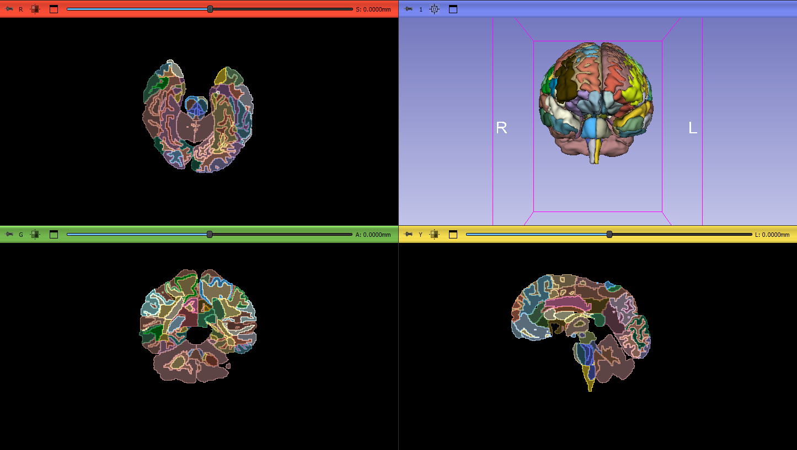

# SlicerBrainParcellation275

This repository contains the code for two Slicer modules that can be used to segment brain structures on T1-weighted MRIs.

Segmentations are performed using convolutional neural networks (CNNs), i.e., deep learning models. They take less than a minute on a graphics processing unit (GPU).

### Add directory in Slicer

In Slicer, go to `Edit -> Application Settings -> Modules` and add the cloned/downloaded folder to the `Additional module paths`. When prompted, restart Slicer.


# What Does This Extension Do?

This extension takes **NIfTI** (Neuroimaging Informatics Technology Initiative) format MRI or similar medical imaging files and processes them by dividing the image into 275 distinct anatomical regions. Each region is then labeled with a corresponding name. Additionally, a CSV file is generated that lists the volumes of these regions.

### Process Steps

1. **Loading the NIfTI File**: The extension first takes the NIfTI file provided by the user and performs any necessary preprocessing steps.

2. **Segmentation into Regions**: The NIfTI image is segmented into 275 different regions of the brain. These regions correspond to anatomical areas commonly used in neuroimaging research and medical diagnostics.

3. **Labeling**: Each region is labeled according to a standard or reference atlas. These labels help identify the functional or structural areas of the brain, making it easier to interpret the data.

4. **Volume Calculation**: The volume of each region is calculated. This volume represents the physical space occupied by the region and is often used in neuroanatomical studies and assessments.

5. **CSV File Creation**: A **CSV file** is created containing the name and volume of each region. This file provides a structured format for users to easily analyze the volumes of the brain regions.

### Use Cases

- **Brain Mapping and Analysis**: The segmentation and volume analysis of brain regions are crucial for studying neurological diseases and developmental changes.
- **Medical and Research Applications**: In neuroscience research, accurate labeling of brain regions and volume measurements are essential for understanding brain structures and functions.
- **Brain Structure-Function Relationships**: This method can help in understanding how different brain regions are related to specific functions or disorders.




## Model Setup

To set up the deep learning models required for brain segmentation, please follow these steps:

1. [Click here](https://drive.google.com/file/d/1rslTenl_TutBWi7uIlXJXrimZB3RgtxE/view?usp=sharing) to download the `MODEL_FOLDER.zip` file from Google Drive.
2. Extract the downloaded `MODEL_FOLDER.zip` file.
3. Place the extracted `MODEL_FOLDER` directory into the `BrainSegmentation` folder in this repository. This `MODEL_FOLDER` contains the deep learning models necessary for segmentation.

After completing these steps, the model files will be set up, and you’ll be ready to run the brain segmentation module.


## Requirements

This project uses deep learning models built with **PyTorch**. To perform computations on a GPU, please ensure you have the following dependencies installed:

- **CUDA 11.8** 
- **cuDNN 8.9.7**

These libraries are necessary to enable GPU acceleration, which significantly speeds up the segmentation process.

For CUDA and cuDNN installation instructions, refer to the official documentation:

- [CUDA 11.8 Installation Guide](https://developer.nvidia.com/cuda-11-8-0-download-archive)
- [cuDNN 8.9.7 Installation Guide](https://developer.nvidia.com/rdp/cudnn-archive)

**Note**: When installing cuDNN, be sure to select the version compatible with **CUDA 11**.

Make sure your environment is configured to use these libraries to take full advantage of GPU support.


## PyTorch with CUDA Installation for 3D Slicer

To enable GPU acceleration using PyTorch in 3D Slicer, you need to install PyTorch with CUDA support. Follow these steps to install the required libraries:

### 1. Install CUDA and cuDNN

Before installing PyTorch, ensure that **CUDA 11.8** and **cuDNN 8.9.7** are properly installed on your system. These libraries are required for GPU acceleration in PyTorch.

- **CUDA 11.8** Installation:  
  Follow the official installation guide here:  
  [CUDA 11.8 Installation Guide](https://developer.nvidia.com/cuda-11-8-0-download-archive)

- **cuDNN 8.9.7** Installation:  
  For **CUDA 11.8**, download the corresponding version of cuDNN here:  
  [cuDNN 8.9.7 Installation Guide](https://developer.nvidia.com/rdp/cudnn-archive)

Follow the instructions to set up these libraries on your system.

### 2. Install PyTorch with CUDA Support

After installing CUDA and cuDNN, you can install PyTorch with CUDA support in your 3D Slicer environment. Use the following steps:

1. **Open 3D Slicer** and go to the Python Interactor or use the command line.

2. **Install PyTorch with CUDA** by running the following command in the Python Interactor:

   ```python
   slicer.util.pip_install('torch torchvision torchaudio')
